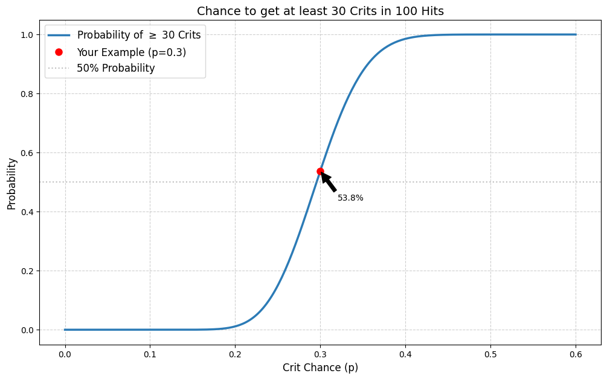

### Authors

[[Author-Orfeus]]

### Peer review done by:

none

### Related nodes:

none

## Introduction
In wow game many things are determined by a pseudo random number generator which determines number of successes in a sequence of N independent trials, each asking a yes–no question: Will it hit or not? Will it crit or not? Etc. So we are dealing with probabilities, namely with binomial distribution - coin flips.

>I assume the trials are independent of each other, meaning the game doesn't remember how many times I didn't suceed a trial to make it more likely, but rather just putting a chance of successful trial on each hit.

## The formula
The probability of getting exactly k successes in N independent Bernoulli trials (with rate of probability p) is given by the probability mass function:

$$
\begin{pmatrix}
N \\
k
\end{pmatrix}
p^k
(1-p)^{N-k}
$$

where:

$$
\begin{pmatrix}
N \\
k
\end{pmatrix}
= \frac{N!}{k!(N-k)!}
$$

>You can think of it, for instance of a case of determining crits, as k = number of crits, N = number of successful hits and p = crit chance. The resulting number will be the chance to get the desired number of crits (k)

## The example
Let's assume 100 hit long fight, our crit chance is 30% = 0.3 and we want to know what is the chance to get exactly 30 crits:

$$
\begin{pmatrix}
100 \\
30
\end{pmatrix}
0.3^30
(1-0.3)^{100-30} = 0.086784
$$

>This is 8.6% chance only to get the exact amount of successful trials.

## Volatility

As raiders we are rather interested in the chance of getting at least, lets say, 30 positive trials in 100, or more, which is then: 53.77% 

We can plot how the effect of different trial chance behaves when we consider this logic:

This plot doesn't show how many positive trials we will get, but the chance of scoring more, than is our chance. But this chance will always hover around the 50% no matter our sucessful trial rating.

Also the more trials there are, the closer we will move to the average, for 100 it is around 54%, for 1000 we are already at 51.2%

## Short vs. Long Encounters

This means on short encounters our performance can vary significantly, if you are in a raid with high DPS performance, you are more likely to set new records, because volatility on shorter time windows can help, this is what I noticed on my mage on Brutallus when we were all BiS, I could do 3.4k+ DPS. But also you are more likely to underperform. If the encounter is long, then the numbers will tend to lean toward the average values. Your performance will be consistent, but getting lucky RNG to set new rocords will be much more unlikely.

## Effect of sucessful trial rating on volatility

Here I set a shorter fight - 50 casts, as you can see the closer we move to 50% sucessful trial rating, the more we increase the volatility.

## How to approach it

There is no correct general way, you can tend to work with averages for consistency, or trying your luck with volatility. Each class or situation can benefit or struggle from something else. 

## Sources

https://en.wikipedia.org/wiki/Binomial_distribution

## Python

You can run the script used to generate the plots in google colab

[Download the Python Script](hit_mechanics_of_random_number_based_game_2.py.py)
